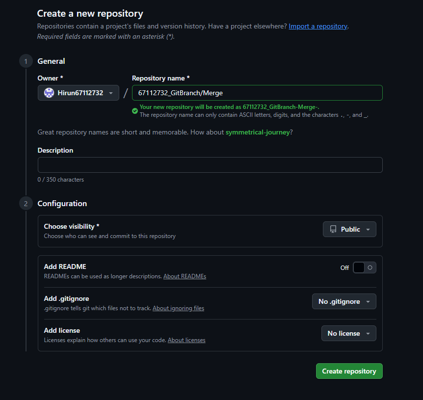
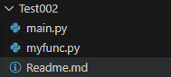

ชื่อ: หิรัญ สุขสมรัตน์
รหัส: 67112732

อธิบายการดำเนินการ
1. สร้าง Repo ใหม่ 
    - สร้าง Repo ใหม่ใน Github
    
    - Clone มาลงใน Vs code แล้วนำไฟล์ Repo ใหม่ในเว็บ Github เข้า VS Code
    

2. นำงานจาก test001 มาเป็น ตัวหลัก ใน branch main
    - คัดลอกไฟล์จาก `Test001` (Readme.md, test.txt, test.py) ไปใส่ 67112732_GitBranch-Merge
    
    
    - Commit และ Push ไปยัง branch `main` ใส่คำสั่งใน Terminal
    

3. เพิ่ม branch FromTest2  และเพิ่ม folder ย่อย Test002 แล้วนำข้อมูลจากงาน Test002 มาวาง
    - เปิด Source Control
    
    - กดเลือก branch → เลือก Create new branch 
    
    - เพิ่มโฟลเดอร์ `Test002` และวางไฟล์จากงาน Test002 (`Readme.md`, `myfunc.py`, `main.py`)
    
    - Commit และ Push ไปที่ GitHub  
    