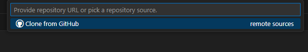

ชื่อ: หิรัญ สุขสมรัตน์
รหัส: 67112732

อธิบายการดำเนินการ
1. สร้าง Repo ใหม่
 - สร้าง Repo ใหม่ใน Github
 
 - Clone มาลงใน Vs code แล้วนำไฟล์ Repo ใหม่ในเว็บ Github เข้า VS Code
 

2. นำงานจาก test001 มาเป็น ตัวหลัก ใน branch main
 - คัดลอกไฟล์จาก `Test001` (Readme.md, test.txt, test.py)
 
 - Commit และ Push ไปยัง branch `main`